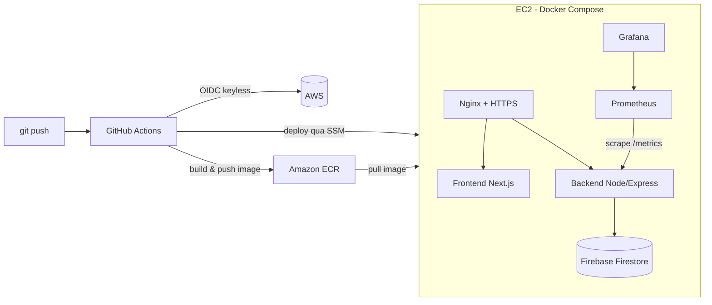

# ✈️ AirlineV — Web đặt vé máy bay + Pipeline DevOps end-to-end

> Ứng dụng web đặt vé máy bay **full-stack**, được container hóa và triển khai **tự động** lên **AWS production** — từ code → Docker → hạ tầng bằng Terraform → CI/CD → giám sát. Dự án cá nhân nhằm thực hành trọn vẹn vòng đời DevOps trên một sản phẩm thật.


---

## 🏗️ Kiến trúc & luồng triển khai



**Một lần `git push` → tự build image → đẩy lên ECR → deploy xuống EC2 qua SSM, hoàn tất ~4 phút.** Toàn bộ hạ tầng AWS được dựng lại bằng một lệnh `terraform apply`.

---

## 🛠️ Tech Stack

| Mảng | Công nghệ |
|---|---|
| **Cloud / IaC** | AWS (VPC, EC2, ECR, IAM, SSM), Terraform |
| **CI/CD** | GitHub Actions, OIDC keyless, Amazon ECR, AWS SSM |
| **Container** | Docker, Docker Compose |
| **Web Server / TLS** | Nginx (reverse proxy), Let's Encrypt + Certbot (tự gia hạn) |
| **Monitoring** | Prometheus (`prom-client`), Grafana |
| **Frontend** | Next.js 15, React 19, Redux Toolkit, TailwindCSS |
| **Backend** | Node.js, Express 5, Firebase Firestore |
| **Auth / Security** | Session-cookie, CSRF token, Google Sign-In, phân quyền User/Admin |

---

## ⚙️ Điểm nhấn DevOps

- **Infrastructure as Code** — toàn bộ hạ tầng AWS (18 tài nguyên: VPC, Subnet, Security Group, EC2, ECR, IAM Role, SSM) được codify bằng Terraform, dựng lại sạch chỉ bằng một lệnh, loại bỏ thao tác Console thủ công.
- **CI/CD tự động** — GitHub Actions tự lint → build Docker image → push lên ECR → deploy EC2 qua AWS SSM mỗi lần push (`~4 phút/lần`).
- **Bảo mật pipeline** — xác thực **OIDC keyless** giữa GitHub và AWS, **không lưu access key tĩnh** trong repository; deploy qua SSM nên EC2 không cần mở cổng SSH.
- **HTTPS** — Nginx reverse proxy + chứng chỉ Let's Encrypt tự gia hạn (Certbot) trên domain riêng.
- **Observability** — Prometheus thu thập metrics qua `prom-client`, Grafana dashboard trực quan hóa hiệu năng & hỗ trợ phát hiện sự cố realtime.

---

## ✨ Tính năng ứng dụng

- 🔐 Đăng nhập an toàn: email/password hoặc Google Sign-In, bảo vệ phiên bằng session-cookie + CSRF token
- ✈️ Tìm kiếm & gợi ý chuyến bay qua API
- 👥 Phân quyền User / Admin riêng biệt
- 🌐 Responsive trên desktop & mobile

---

## 🚀 Chạy local

```bash
# Bản development (kèm Prometheus + Grafana)
docker compose up -d

# Truy cập
# Frontend:    http://localhost:3000
# Backend:     http://localhost:8080
# Prometheus:  http://localhost:9090
# Grafana:     http://localhost:3001
```

> ⚠️ Cần tạo `backend/.env` và `backend/serviceAccountKey.json` (Firebase) — đã được `.gitignore` để tránh lộ secret.

---

## 📂 Cấu trúc thư mục

```
.
├── backend/                # Node.js + Express API (Firebase, prom-client)
├── frontend/               # Next.js 15 + React 19
├── monitoring/             # Cấu hình Prometheus + Grafana dashboards
├── terraform/              # IaC: VPC, EC2, ECR, IAM, SSM
├── .github/workflows/      # CI (ci.yml) + CD (cd.yaml)
├── docker-compose.yml      # Môi trường dev (kèm monitoring)
└── docker-compose.prod.yaml# Production (Nginx + Certbot, pull image từ ECR)
```

---

## 📌 Ghi chú

Dự án được phát triển như một **bài thực hành DevOps end-to-end**: tự xây ứng dụng, container hóa, codify hạ tầng, tự động hóa CI/CD và giám sát hệ thống trên môi trường AWS thật.

👤 **Nguyễn Tiến Trung** · [LinkedIn](https://www.linkedin.com/in/nttrung0305) · [GitHub](https://github.com/NguyenTienTrung0305)
